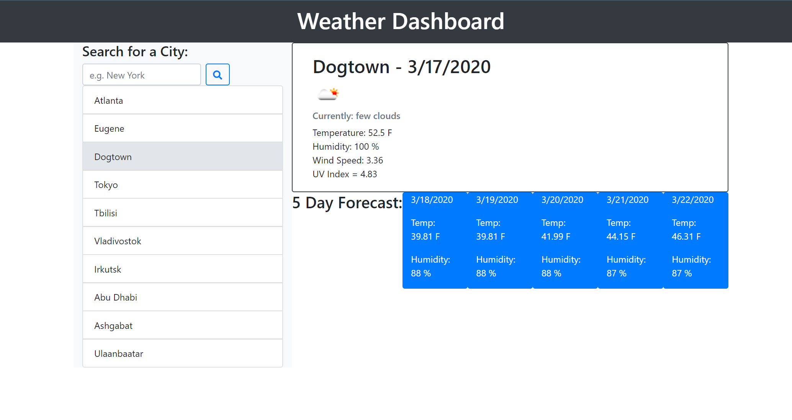
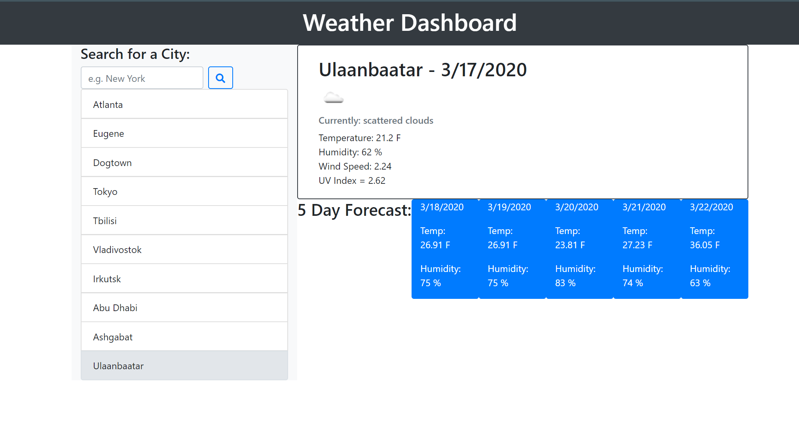

# Jayson Duff's Weather App

## view here: https://fmiusov.github.io/homework-6-weatherapp/

## Instructions:

Enter a city name (from anywhere in the world) into the Search form and click the search icon

Your city is added to a city list, from there select your city to receive current weather and five day forecast

Continue adding cities to your list and toggle between them as needed

## Gallery:

